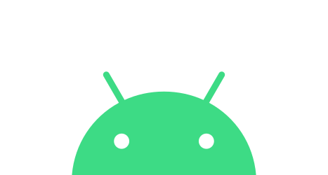

<link href="css/marp-custom.css" rel="stylesheet">

<!--
_class: lead
header: ' <div style="float:right; margin-top:0px; margin-left: 0.3em;">4120/5120</div>'
-->

<style>
section.lead h2 {
  font-size: 1.25rem;
  color: #F05138;
}

section.lead h4 {
  margin-top: -8px;
  font-weight: normal;
}

section.end h1 {
  color: #F05138;
}

</style>

# <!-- fit --> Mobile App Development
## Zef Houssney
#### Lecturer


---

## You were lied to.

The [course description](https://docs.google.com/document/d/e/2PACX-1vRoVL8WLgDbpwAF4omonWs6cNrovlE1mLtHyOyC40ESNVz7WgUQLUhPTMZ3B62I6TwZCZ5sZnP5uOGn/pub) states:

> Focuses technically on the iOS and Android platforms

* I don't know Android.



<!--
That being said:
- I've worked on cross-platform teams
- kotlin similar to Swift
-->

---
<!-- _class: lead -->

# <!-- fit --> iOS App Development
## Zef Houssney
#### Freelance Software Developer


---

## The Goal:

- Teach you how to develop apps.

* Holistic.
* How to code.
* Talk about App design, UI, UX.
* Learn software engineering practices and principles.
* Use development tools like `git` and the command line.
* Collaborate. Perform code reviews. Encourage and influence one another.
* Generally interesting and useful, even if you never write another app.

<!--
Not just "how to code"

- Can't learn everything, if we tried to, it would be outdated by the time we finished.
- Principles
- Write, understand, and debug code
- Learn how learn, how to figure it out on your own
- the mindset using a computer as a developer
- I hope to provide a unique opportunity
-->

---

## I hope that you will:
* Ask questions. Engage. Interrupt.
  * Otherwise, just go watch videos and read tutorials.
* Share ideas. Find examples.
* Disagree.
* See things I don’t see, and say something.
* Teach me.
* Make cool stuff.

<!--
Examples of:

Patterns, good and bad
Pitfalls

Great user interfaces
Bad user interfaces
-->

---
## Grading:


```swift
func calculateGrade() -> Float {
  // TODO: Don't forget to implement this before class
  return 0
}
```
---

## Extra Credit

The course materials are _✨Open Source✨_

* contribute to my [lecture repo](https://github.com/zef/ATLAS-iOS)
  * corrections:
    - typos
    - innacuracies
    - bug reports & bug fixes
  * suggestions for clarification or improvement
    - [File an Issue](https://github.com/zef/ATLAS-iOS/issues/new) on GitHub

---

## My story

---

# Question Time!


## What are your goals?

- Why do you want to learn iOS development?

- What do you think of when you picture what an app is made of?

- What do you think of when you picture the process of making an app?

- Regarding mobile app development, what are your primary interests?

- How many people don't have a Mac to use?
- Do you have an iPhone or iPad?

- Do you want a chatroom?

---


## Directives

By next class, you should:

* Sign up for an [Apple Developer account](https://developer.apple.com)
* Install [Xcode 14 (beta)](https://developer.apple.com/xcode/)
  - Launch and install the Command Line Tools
  - [SF Symbols beta](https://developer.apple.com/sf-symbols/)
* Have a [GitHub](https://github.com) account
* start making a list of app ideas

---

<!-- _class: end -->

### Next time:

# Introducing Swift

